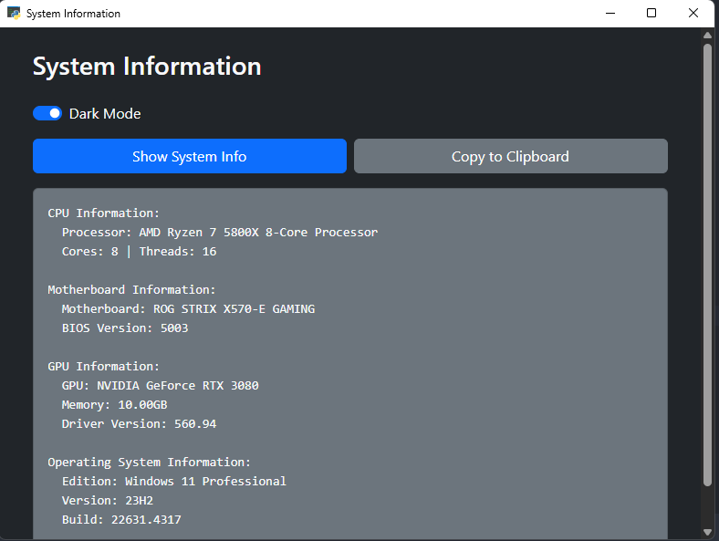

# System Information App - User Guide

## Overview

This application provides detailed system information through a graphical user interface (GUI). The system information is fetched from the user's machine and displayed in a user-friendly format using an embedded webview.

## Prerequisites

- Python 3.10+
- Required Python modules:
  - `webview`
  - `logging`
  - `multiprocessing`
  - `os`, `sys`
  - Custom module: `system_info` (contains the function `fetch_system_info()`)
- HTML file for GUI: The app requires an HTML file named `index.html` located in the `gui` directory.

## Screenshot


## Installation

To install the required Python modules, you can use `pip` with the provided `requirements.txt`:

```bash
pip install -r requirements.txt
```

You also need to make sure the custom `system_info` module is present and correctly implemented in the same directory.

## Running the App

1. Clone the repository to your local machine.

2. Navigate to the directory where the script is located.

3. Run the application:

```bash
python main.py
```

The app will create a log directory named `system_info_logs` in the current directory. All log files will be stored there.

## Features

- **Fetch System Information**: Displays detailed information about your system, such as CPU, memory, storage, etc.
- **Rotating Log Files**: The app generates log files in the `system_info_logs` folder, with log rotation enabled to ensure the log file size does not exceed 1MB, keeping up to 3 old versions.
- **User-friendly GUI**: The GUI is rendered using `pywebview`, allowing interaction with system information in a simple, intuitive manner.

## Logging

- Logs are stored in the directory: `./system_info_logs`
- Log rotation ensures that logs do not exceed a manageable size. Each log file is limited to 1MB, with up to 3 backup log files maintained.

